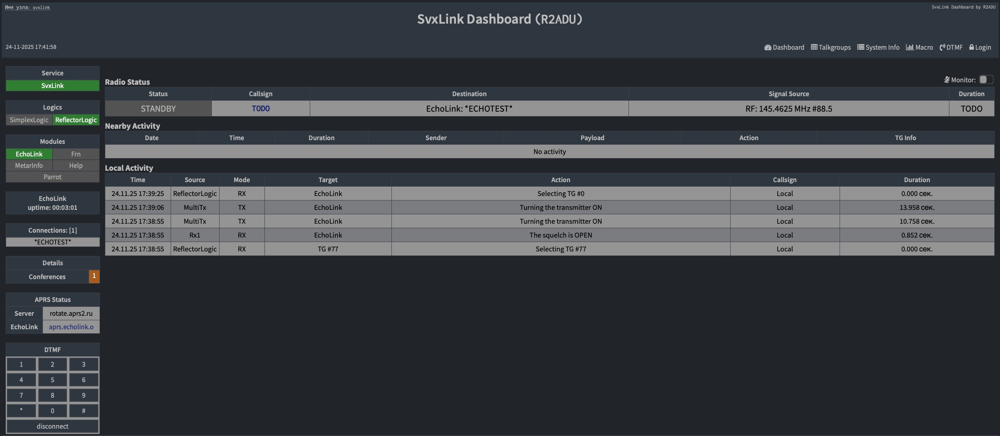
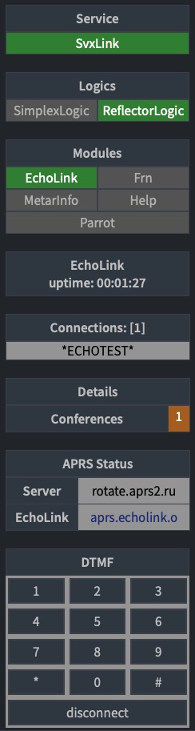
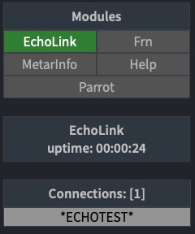
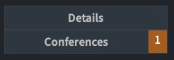

# Svxlink Dashboard

## Вдохновение

Этот проект был вдохновлен функциональностью:
- [SVXLink-Dashboard-V2 от F5VMR](https://github.com/f5vmr/SVXLink-Dash-V2)
и дизайном
- [WPSD Project](https://w0chp.radio/wpsd/)
## Лицензия

Этот проект содержит элементы дизайна, производные от WPSD Project,
распространяемые под лицензией GNU FDL v1.3.

Original copyright: Copyright © 2023 WPSD Project Development Team, et al.

## Описание

Полностью переписанная реализация панели управления SVXLink с современной архитектурой.

## Особенности

- Новая архитектура серверной части, переписанная с нуля

- Пользовательский интерфейс в стиле WSPD

- Информативная панель состояния с информацией о соединениях Echolink,Frn,ReflectorLogic

- Разговорные группы рефлектора

- Подключенные узлы Эхолинка

- Подключенный сервер Frn	

- Отображение типов подключенных узлов

- Клавиатура DTMF для управления svxlink

## Технические примечания

Это независимая реализация, вдохновленная оригинальным SVXLink-Dashboard-V2, 
но написанная с нуля под собственные нужды.

## ⚠️ Важное примечание о совместимости

**Данный проект НЕ является заменой или обновлением оригинального SVXLink-Dashboard-V2**

Это независимое ответвление (fork) со значительными architectural changes, которые:
- ❌ **Не совместимы** с оригинальной кодовая базой
- ❌ **Не могут** быть использованы как drop-in replacement
- ❌ **Не принимают** Pull Request'ы для оригинального проекта

## Сравнение с оригиналом

| Характеристика | Оригинальный проект | Данный форк |
|----------------|-------------------|-------------|
| Архитектура | Монолитная | Микросервисная |
| Backend | PHP | Node.js/Python |
| Стиль интерфейса | Pi-star like | WSPD-style |
| Совместимость | - | ❌ Не совместим |

## Для пользователей оригинального проекта

Если вы ищете:
- **Обновления для оригинального SVXLink-Dashboard-V2** → обратитесь к [оригинальному репозиторию](https://github.com/f5vmr/SVXLink-Dash-V2)
- **Совместимые улучшения** → этот проект не для вас
- **Полностью переработанную альтернативу** → продолжайте чтение

**⚠️ IMPORTANT: This release is NOT compatible with the original SVXLink-Dashboard-V2**

This is an independent fork with:
- Complete backend rewrite
- Redesigned WSPD-style interface
- Breaking changes from original architecture